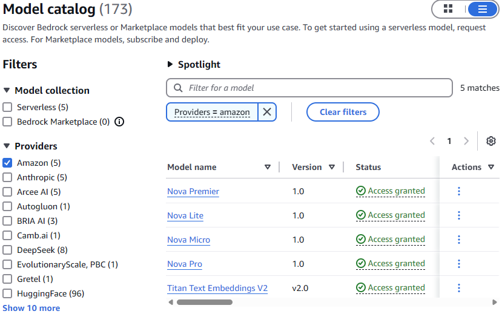
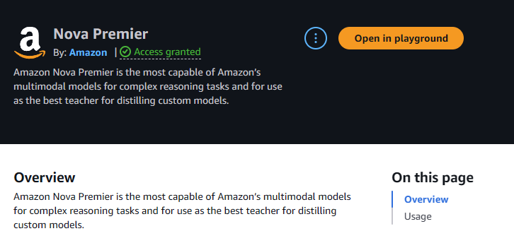
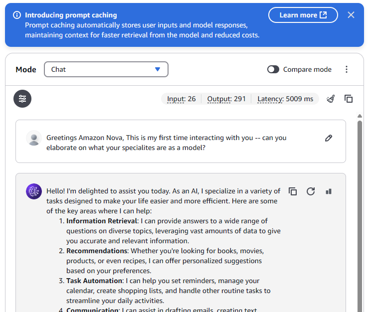

# Getting Started With Amazon Nova Agent Orchestration

Version 1.0 of the Amazon Nova AI models have recently been released, and [there have been becnchmarks](https://aws.amazon.com/blogs/machine-learning/benchmarking-amazon-nova-and-gpt-4o-models-with-flotorch/) of how well they perform (hint: the cost-efficiency is better than GPT-4o), but today I'm here to start at a more base level.  Many of the articles that talk about Models and Context and Agents assume that we have a working knowledge of such things, and but let's take a minute to back up and walk through a zero-to-hero style overview of how to take advantage of the tech that is out there today. Let's dig into Amazon Nova!

## Log into Amazon Bedrock in the AWS Console

For now, Amamzon Bedrock will be our starting place for all things Nova.  AWS has done a great job of rolling everything we need into the Amazon Bedrock console so let's start there.  First (after clicking on Amazon Bedrock) take a look at the Model catalog on the left hand side.  I have access to the Amazon models, but you may need to request access to them via the "Model Access" link on the lower left hand side of the console window.  That process is easy, and takes a few clicks, assuming your IAM Role has permissions to add them to the account.  

Once you're approved for the Amazon Models, you should be able to see them in the Model Catalog if you filter for "Amazon":  

Click on "Nova Premier" and it should take you to the model overview page:  

Clicking on the "Open in playground" will create a chat prompt for you to interact with the model directly:  

Now that we are able to chat with Nova Premier, we can continue to the next topic.

## Adding Data with RAG (Retrieval Augmented Generation)

Models are generally trained on public datasets, so they have working knowledge of conversations, and topics that are covered on the datasets they're trained on.  If you ask them questions about things that are outside of their area of expertise, they tend to either make up answers or admit they don't know (the former being somewhat dangerous, actually).  

