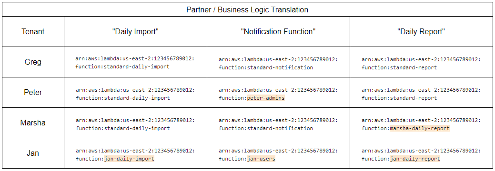
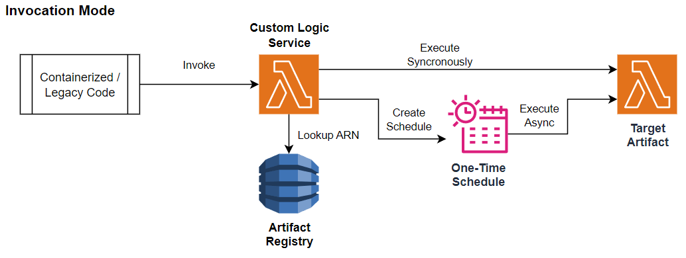

## Modernizing custom SaaS logic withh Lambda, EventBridge, and Step Functions 
Often with a B2B SaaS product, enterprise implementations require customizations that are embedded in legacy libraries, custom deployments, or configuration rules that are encoded in custom pieces of code and not part of the execution environment.  These custom pieces of code may be event-based, can be synchronous (in the case of validations) or asynchronous (in the case of integrations), or periodic in nature.  In this blog post, we will discuss how using AWS Lambda, AWS EventBridge, and AWS Step Functions can provide a path to modernizing these pieces of code such that the customizations are triggered on-demand and very cost-effective.  

By using this approach, modernization teams can isolate tenant-specific code, which allows for creating tenant-agnostic containers or environments that allows for a standardized, multitenant application to be published to end-users.  At Caylent, this is one of the major barriers that we see to cloud adoption of legacy SaaS based products, where customer-specific logic may be embedded in custom modules, sql statements, or environment configurations.  

## Solution Overview

The solution that we decided on involves using an intermediary service that tracks artifacts (Lambdas or Step Functions), schedules, and allows using a common name to look up the approprate ARN for a tenant-specific piece of logic.  We will call this intermediary service "Custom Logic Service" since it allows invocation of artifacts dynamically based on a common name.  Invoking the artifact for "Daily Report" or "User Account Validations" from the client side can be translated to a specific Lambda or Step Function ARN depending on the tenant.

By basing our solution around [AWS EventBridge Scheduler](https://aws.amazon.com/eventbridge/scheduler/), and invokable artifacts, we were able to:
- Enable multitenancy in our EKS Cluster Binaries by refactoring custom code
- Reduce the binary artifact footprint for our container images
- Eliminate the need for one-off services to be running consistently checking schedules for executions
- Eliminate the need to deploy a multitude of always-on, redundant services (and associated config URLs) with slight differences in implementation details
- Realize AWS savings by running on-demand workflows as serverless instead of always-on instances or containers

## Technical Architecture

At the simplest level, it's easy to have a service that directly invokes a Lambda.  By using a dynamodb to store the launch configurations and ARNs of the common logic pieces, we could refer to aliases for the versions of our Lambdas.  That way, we can use the same client-side invocation for all lambdas called "Daily Report" and map them to different ARNs based on the client (or re-use a standard ARN in the case of no customizations). 

At the simplest level, it's easy to have a service that directly invokes a Lambda.  By using a dynamodb to store the launch configurations and ARNs of the common logic pieces, we could refer to aliases for the versions of our Lambdas -- things like "Daily Report" or "User Account Validations" could be mapped to a specific Lambda ARN depending on the tenant.  That way, we can use the same client-side invocation for all lambdas called "Daily Report" and map them to different ARNs based on the client (or re-use a standard ARN in the case of no customizations).  

This allows professional services teams to select custom logic items when the tenant is set up.  In the examples above, Greg has a completely standardized implementation, Peter and Marsha have some customizations, and Jan is a completely custom implementation.

Invocation either does a direct invocation on the ARN for that tenant, or creates a one-time schedule via [AWS EventBridge Scheduler](https://aws.amazon.com/eventbridge/scheduler/) to execute the Lambda asynchronously.  Since our implementation of asyncronous invocation did not implement callbacks to the main app, we relied on a database connection in the tenant's environnment configuration to update the database and/or endpoint targets with the relevant results.  

Some pieces of logic aren't processes invoked via the normal app stack, but scheduled events that happen throughout the day/week/quarter.  For these types of tasks, the Custom Logic Service manages EventBridge Schedules, accepting a set of launch parameters and a cron expression for when to invoke the ARNs in question:  

All of this depends on the Custom Logic Service having the ability to interact with the AWS SDK at a programmatic level.  At a minimum, EventBridge Schedules need to be created and removed by the Custom Logic Service appropriately, the Lambdas need to be invoked, and it needs to have a repository for mapping the business aliases for a tenant to AWS ARNs to be invoked.

For our solution, we also included a Control Plane for the artifacts, ensuring that we had consistent labeling, metadata, and tagging standards applied to all of the new artifacts that we were registering in the solutions:

This allows segregation of responsibilities, where the Control Plane is responsible for creating and managing the objects in AWS, and the Custom Logic Service is responsible for execution, metadata, and tenant-specific logic.

Scaling this service up is generally limited by the service limits -- for the tenant-specific roles, there is a default quota of 1000 IAM Roles per account, so using advanced governance strategies (in a multi-account fashion) such as AWS Organizations managed by AWS Control Tower may be necessary if you are managing many individual tenant roles.

## Benefits and Outcomes

We realized a number of benefits from this approach, notably:

- Artifacts can be invoked using a common name by the legacy system.  This allows for tenant-agnostic invocations of custom artifacts.
- Artifact code can consume parameters that are passed by the upstream system, or connect to the configuration environment directly.
- For our case we are referring to artifacts as Lambdas, but Lambdas have certain service limits.  By expanding the definition of "artifact", we can apply the same logic to any service within AWS that the Custom Logic Service supports, without changing the upstream code:
    - AWS Step Functions Workflows (Standard OR Express)
    - ECS Fargate Tasks
    - AWS Batch Jobs (in EKS)
- Since the execution role of the artifacts is set at registration time, we can attach tenant-specific IAM roles to the artifacts.
- Given the appropriate role permissions, a tenant could give authorization to objects in their AWS account and use cross-account permissions for custom logic.
- Logs for the custom logic are conveniently placed in CloudWatch.  We found it advantageous to add [Structured Logging](https://aws.amazon.com/blogs/developer/structured-logging-for-net-lambda/) to the Lambda functions to capture details of which tenant was executing the artifact. 
- Blue-green and Canary deployments can easily happen, since a new version of the artifact isn't configured for a client until the Custom Logic Service targets a different artifact for the same alias.  That way, a new version of an artifact can be thoroughly tested before transitioning.

Most importantly, using this approach saved money on AWS consumption, by allowing AWS cloud-native services to run on-demand and at intervals.  This eliminated the need for EC2 instances or containers deployed to EKS listening to events or running cron tasks.

## Conclusion

Many B2B SaaS providers are able to adopt their solution to customers needs, and historically that was through various configuration setttings, SQL scripts, or dynamically loading custom libraries.  With the power of serverless cloud computing, those custom processes and integrations can be moved to the serverless cloud and organized with a simple service.  This allows the bulk of any application to be deployed in a consistent, scalable way while maintaing the external logic that needs to run on-demand for a specific customer.

To learn more about migrating custom logic to serverless solutions, please contact us via our [AWS Partner Network Page](https://partners.amazonaws.com/partners/001E000001QMw8yIAD/Caylent) or our [Website](https://caylent.com/).  Jeremy Yelle is a Software Architect at Caylent with over 20 years of in enterprise SaaS products, most recently focusing on transitioning legacy stacks to cloud native technologies.  Caylent was named the [AWS Migration Partner of the Year](https://aws.amazon.com/blogs/apn/announcing-the-2024-geo-and-global-aws-partners-of-the-year/) and has over 2000 customer launches on AWS Services.

