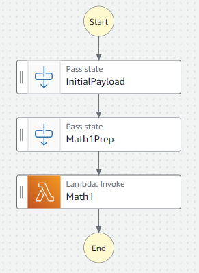
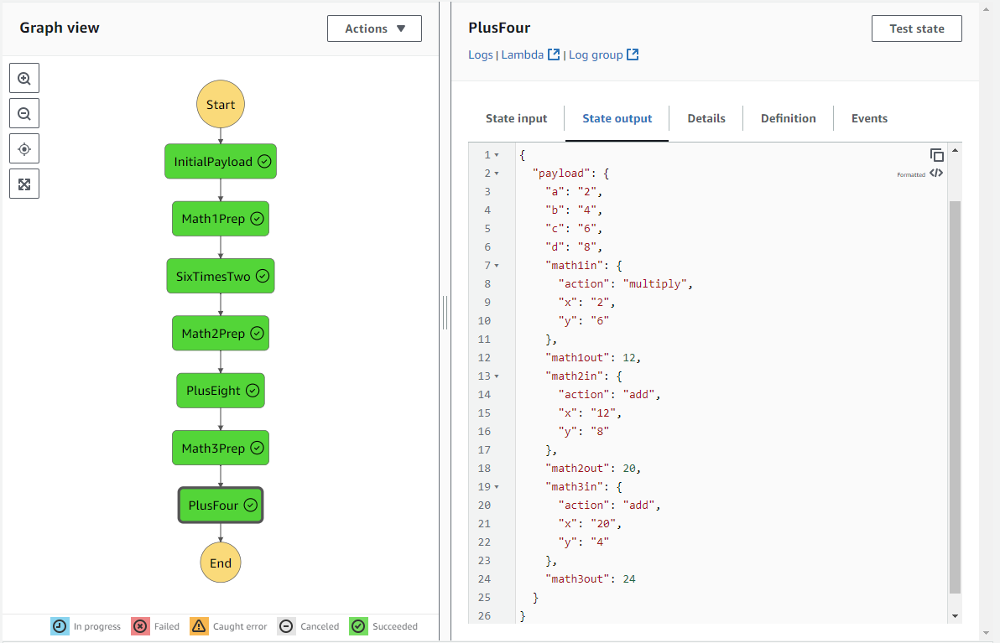
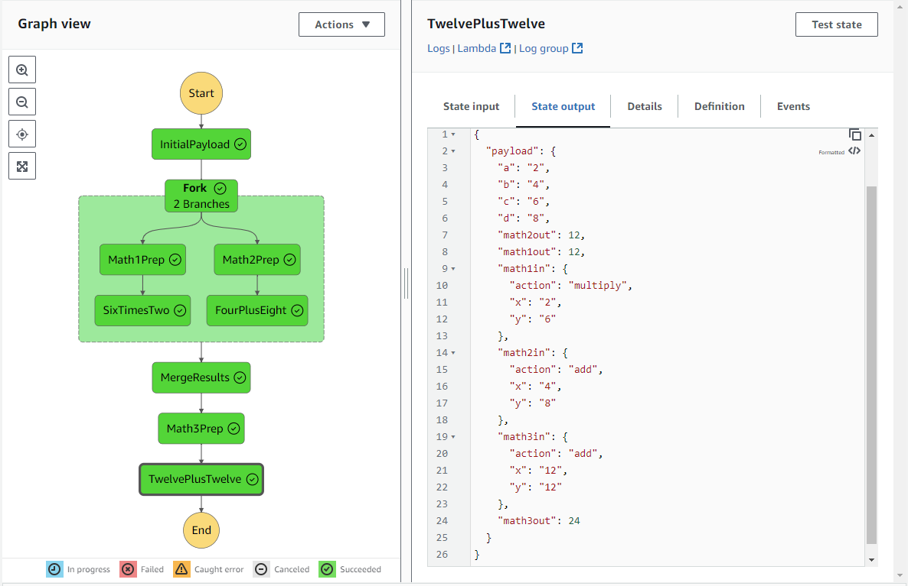

# The Twenty-Four Challenge

One of my favorite games growing up was a game called the [24 Game](https://www.amazon.com/24-Game-Single-Digit-cards/dp/B002AODZFQ/) where a group of friends could take a group of numbers from a card and use the order of operations and basic arithmatic to add, subtract, multiply, and divide the numbers on the card to get to a value of 24.

Combined with the [Lambda Calculator](https://github.com/awsdocs/aws-doc-sdk-examples/tree/main/dotnetv3/Lambda/LambdaCalculator/LambdaCalculator) from the AWS C# SDK, I thought it might be a neat way to demonstrate [Amazon Step Functions](https://aws.amazon.com/step-functions/)'s basic capabilites.

### The Simple Case

The lambda calculator takes an input payload in JSON and performs basic math on these inputs, directed by the "action" property in the JSON.  We can re-use this same Lambda in a few places in our ASL to accomplish the math we need.  Here's an initial ASL definition to get us started, doing some basic arithmetic.

```
{
  "Comment": "An example of the Amazon States Language for using our 24 Game example",
  "StartAt": "InitialPayload",
  "TimeoutSeconds": 3600,
  "States": {
    "InitialPayload": {
      "Type": "Pass",
      "Result": {
        "a": "2",
        "b": "4",
        "c": "6",
        "d": "8"
      },
      "ResultPath": "$.payload",
      "Next": "Math1Prep"
    },
    "Math1Prep": {
      "Type": "Pass",
      "Parameters": {
        "action": "multiply",
        "x.$": "$.payload.a",
        "y.$": "$.payload.c"
      },
      "ResultPath": "$.payload.math1in",
      "Next": "Math1"
    },
    "Math1": {
      "Type": "Task",
      "Resource": "arn:aws:lambda:us-west-2:123456789011:function:LambdaCalculator:$LATEST",
      "InputPath": "$.payload.math1in",
      "ResultPath": "$.payload.math1out",
      "End": true
    }
  }
}
```

Here's the visual representation (available in the AWS State Machine Editor or VSCode Toolkit) of the flow above:  
  

This ASL will take an initial payload (the four numbers from the card), run it through a pre-state preparation (essentially variable substitution), and execute the Lambda that we need to do the math.  The output of the state machine looks like this:
```
{
  "payload": {
    "a": "2",
    "b": "4",
    "c": "6",
    "d": "8",
    "math1in": {
      "action": "multiply",
      "x": "2",
      "y": "6"
    },
    "math1out": 12
  }
}
```

### The 24 Game

So, now that we have a state machine that does some math in a sequence, let's build one that illustrates how to get to 24.
Adding a few more states (and changing the names of some others) our new state machine looks like this:

```
{
  "Comment": "An example of the Amazon States Language for using batch job with pre-processing lambda",
  "StartAt": "InitialPayload",
  "TimeoutSeconds": 3600,
  "States": {
    "InitialPayload": {
      "Type": "Pass",
      "Result": {
        "a": "2",
        "b": "4",
        "c": "6",
        "d": "8"
      },
      "ResultPath": "$.payload",
      "Next": "Math1Prep"
    },
    "Math1Prep": {
      "Type": "Pass",
      "Parameters": {
        "action": "multiply",
        "x.$": "$.payload.a",
        "y.$": "$.payload.c"
      },
      "ResultPath": "$.payload.math1in",
      "Next": "SixTimesTwo"
    },
    "SixTimesTwo": {
      "Type": "Task",
      "Resource": "arn:aws:lambda:us-west-2:123456789011:function:LambdaCalculator:$LATEST",
      "InputPath": "$.payload.math1in",
      "ResultPath": "$.payload.math1out",
      "Next": "Math2Prep"
    },
    "Math2Prep": {
      "Type": "Pass",
      "Parameters": {
        "action": "add",
        "x.$": "States.JsonToString($.payload.math1out)",
        "y.$": "$.payload.d"
      },
      "ResultPath": "$.payload.math2in",
      "Next": "PlusEight"
    },
    "PlusEight": {
      "Type": "Task",
      "Resource": "arn:aws:lambda:us-west-2:123456789011:function:LambdaCalculator:$LATEST",
      "InputPath": "$.payload.math2in",
      "ResultPath": "$.payload.math2out",
      "Next": "Math3Prep"
    },
    "Math3Prep": {
      "Type": "Pass",
      "Parameters": {
        "action": "add",
        "x.$": "States.JsonToString($.payload.math2out)",
        "y.$": "$.payload.b"
      },
      "ResultPath": "$.payload.math3in",
      "Next": "PlusFour"
    },
    "PlusFour": {
      "Type": "Task",
      "Resource": "arn:aws:lambda:us-west-2:123456789011:function:LambdaCalculator:$LATEST",
      "InputPath": "$.payload.math3in",
      "ResultPath": "$.payload.math3out",
      "End": true
    }
  }
}
```
Note the addition of the [Intrinsic Functions](https://docs.aws.amazon.com/step-functions/latest/dg/intrinsic-functions.html#asl-intrsc-func-json-manipulate) to convert the numeric outputs into string inputs for the Lambda.  If an integer is passed, the Lambda will throw an exception converting the input json to a dictionary of strings.

If you navigate to Execution View and scroll down there is a convenient Historical Graph explorer that allows you to click through the states and see what the state machine looks like at each stage.

 

Notice that our math3out property of the Payload is the answer we're looking for!  Mission Accomplished!

### Taking it to the next level

Let's imagine that we rearrange the order of operations of this Step Function Flow just a little bit, and do this instead:

```
{
  "Comment": "An example of the Amazon States Language for using batch job with pre-processing lambda",
  "StartAt": "InitialPayload",
  "TimeoutSeconds": 3600,
  "States": {
    "InitialPayload": {
      "Type": "Pass",
      "Result": {
        "a": "2",
        "b": "4",
        "c": "6",
        "d": "8"
      },
      "ResultPath": "$.payload",
      "Next": "Fork"
    },
    "Fork": {
      "Type": "Parallel",
      "Branches": [
        {
          "StartAt": "Math1Prep",
          "States": {
            "Math1Prep": {
              "Type": "Pass",
              "Parameters": {
                "action": "multiply",
                "x.$": "$.payload.a",
                "y.$": "$.payload.c"
              },
              "ResultPath": "$.payload.math1in",
              "Next": "SixTimesTwo"
            },
            "SixTimesTwo": {
              "Type": "Task",
              "Resource": "arn:aws:lambda:us-west-2:123456789011:function:LambdaCalculator:$LATEST",
              "InputPath": "$.payload.math1in",
              "ResultPath": "$.payload.math1out",
              "End": true
            }
          }
        },
        {
          "StartAt": "Math2Prep",
          "States": {
            "Math2Prep": {
              "Type": "Pass",
              "Parameters": {
                "action": "add",
                "x.$": "$.payload.b",
                "y.$": "$.payload.d"
              },
              "ResultPath": "$.payload.math2in",
              "Next": "FourPlusEight"
            },
            "FourPlusEight": {
              "Type": "Task",
              "Resource": "arn:aws:lambda:us-west-2:123456789011:function:LambdaCalculator:$LATEST",
              "InputPath": "$.payload.math2in",
              "ResultPath": "$.payload.math2out",
              "End": true
            }
          }
        }
      ],
      "Next": "MergeResults"
    },
    "MergeResults": {
      "Type": "Pass",
      "Parameters": {
        "payload.$": "States.JsonMerge($[0].payload, $[1].payload, false)"
      },
      "ResultPath": "$",
      "Next": "Math3Prep"
    },
    "Math3Prep": {
      "Type": "Pass",
      "Parameters": {
        "action": "add",
        "x.$": "States.JsonToString($.payload.math1out)",
        "y.$": "States.JsonToString($.payload.math2out)"
      },
      "ResultPath": "$.payload.math3in",
      "Next": "TwelvePlusTwelve"
    },
    "TwelvePlusTwelve": {
      "Type": "Task",
      "Resource": "arn:aws:lambda:us-west-2:123456789011:function:LambdaCalculator:$LATEST",
      "InputPath": "$.payload.math3in",
      "ResultPath": "$.payload.math3out",
      "End": true
    }
  }
}
```

This new state machine calculates `2 x 6` and `8 + 4` in parallel and sums them at the end.  However, the tricky thing here (in addition to the new `Parallel` state type) is that the branch functions of a Parallel state create an array with outputs for each branch -- and so to merge those back together we have to have a `Pass` state that uses the `States.JsonMerge` intrinsic function.

This results in the following result:  
 

There are a number of parallel and iterative options, including the `Map` state type.  Amazon States Language is a great way to orchestrate your workflows between Lambdas and other Step-Functions-Integrated AWS Services.  Learning the initial syntax is a little tricky, but there are a lot of powerful capabilities once you do.
